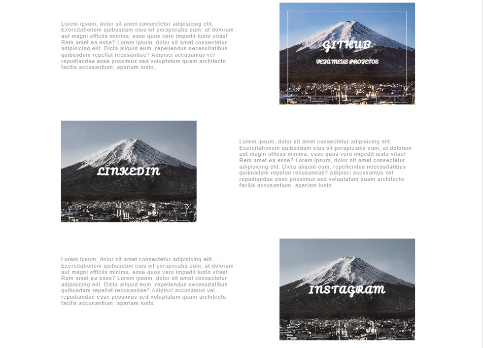
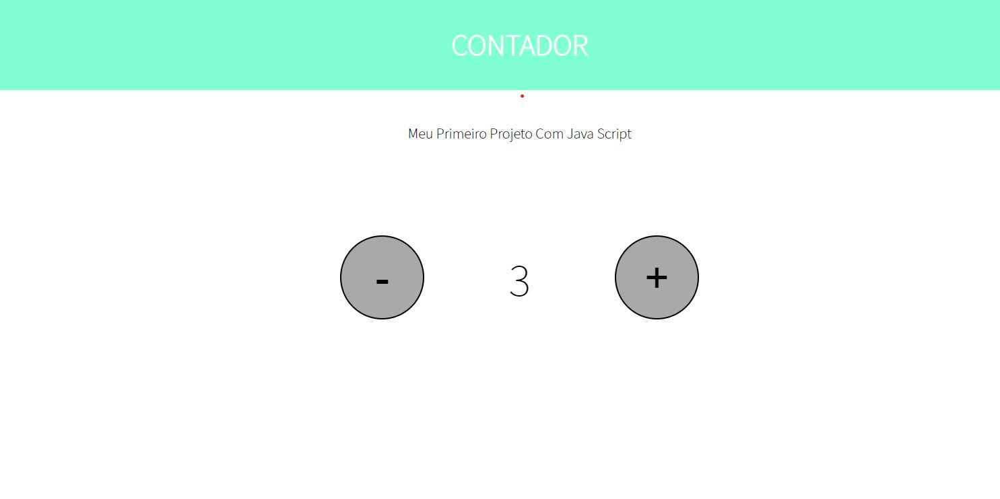
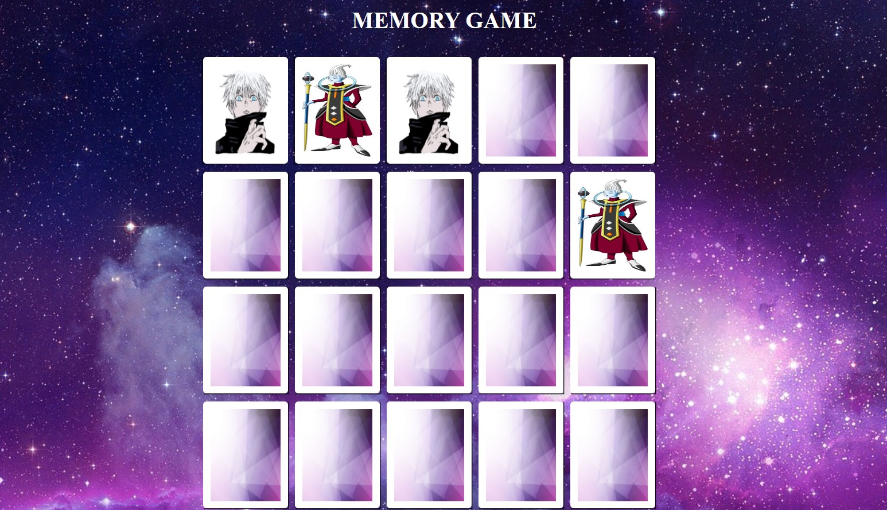

# Notes

Olá, esse repositorio contem alguns projetos e exercicios desenvolvidos no Bootcamp TQI Fullstack Development da DIO.
esse foi o primeiro bootcamp que eu participei e tive os primeiros contatos com desenvolvimento de softwares.

PS: não cheguei a finalizar esse bootcamp, então no repositorio contem apenas os primeiros modulos de front-end.

## Lista de Conteudos:

### Modulo I

- Introdução a Programação
- Introdução ao Git e GitHub.
- Projeto Livro de Receitas

### Modulo II

- Introdução ao HTML e CSS.
- Projeto Pagina Web

### Modulo III

- Introdução ao JavaScript
- Projeto Contador usando JavaScript
- Projeto Jogo da Memoria usando JavaScript.

